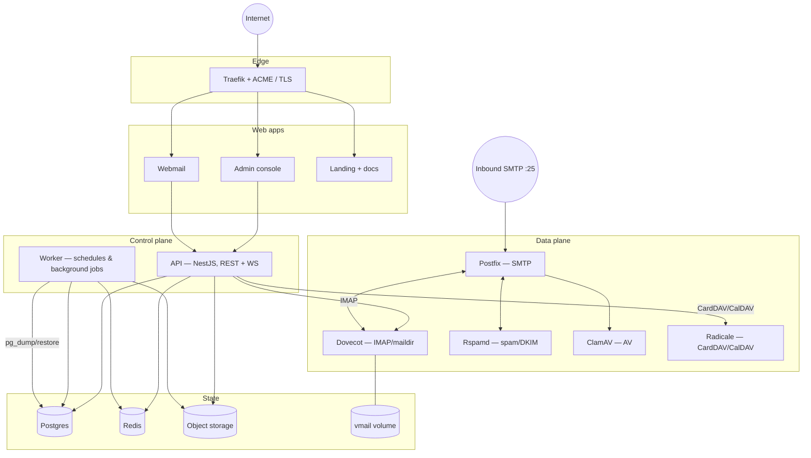

# Architecture

JustMail is a control plane (API + web apps) in front of a standard,
battle-tested mail data plane (Postfix, Dovecot, Rspamd, ClamAV). Everything
runs as containers behind a single reverse proxy.

## Responsibilities

| Component | Role |
|-----------|------|
| **Traefik** | TLS termination, ACME certificate issuance, routing to apps/API. |
| **API** (`apps/api`) | REST + WebSocket control plane. RFC 9457 errors, OpenAPI at `/v1/openapi.json` (rendered at `/v1/docs`), zod-validated config, session/bearer auth. |
| **Worker** (`apps/api`, `worker.ts`) | Timed jobs: webhook delivery, queue snapshots, DNSBL checks, credential sweep, scheduled sends, LDAP/SCIM sync, retention pruning, **database backups**. |
| **Admin / Webmail / Landing** (`apps/*`) | Next.js front ends. Webmail talks IMAP through the API per user. |
| **Postfix / Dovecot / Rspamd / ClamAV** | The mail data plane — SMTP, IMAP + maildir storage, spam/DKIM, antivirus. |
| **Radicale** | Contacts and calendar (CardDAV/CalDAV). |
| **Postgres** | Control-plane state: orgs, domains, mailboxes, settings, audit, backup/retention metadata. |
| **Redis** | Sessions, caches, rate limits, sealed webmail credentials. |
| **Object storage** | Attachments, mailbox exports, and backup archives via a provider-agnostic adapter (`local`/`s3`/`r2`/`minio`/`b2`/`azure`/`gcs`). |

## Data flow notes

- **Config is validated at boot** (zod) and the process fails fast on anything
  missing or malformed.
- **Migrations run at startup** for `api` and `worker`, tracked in
  `schema_migrations`; they are forward-only and idempotent.
- **Storage keys are tenant-prefixed** (`org/<orgId>/…`) by the API layer; no
  caller writes outside its tenant prefix.
- **Admin-level mailbox access** (exports, retention pruning) uses a Dovecot
  master user and is disabled until it is configured.

## Deeper references

- [redesign/06-architecture.md](redesign/06-architecture.md) — full design.
- [redesign/08-database.md](redesign/08-database.md) — schema, RLS, partitions.
- [redesign/05-security.md](redesign/05-security.md) — threat model.
- [multi-node.md](multi-node.md) — scaling beyond one host.
